# Diagrama de Classes — aresta-reader

Este documento descreve a estrutura de classes, interfaces e modelos de dados do sistema completo de leitura `aresta-reader`, contemplando tanto o Backend (Express/Prisma) quanto o Frontend (Nuxt 3/Vue 3/Adapters).

```mermaid
classDiagram
    direction TB

    %% ================= BACKEND MODELS =================
    class Book {
        +number id
        +string title
        +string file_path
        +string cover_path
        +string file_type
        +DateTime created_at
        +BookPublicInfo publicInfo
        +UserBook[] userBooks
        +BookTheme[] bookThemes
    }

    class BookPublicInfo {
        +number id
        +number book_id
        +string author
        +string summary
        +DateTime created_at
        +DateTime updated_at
    }

    class UserBook {
        +number id
        +number user_id
        +number book_id
        +string status
        +number current_page
        +DateTime last_accessed_at
        +DateTime created_at
        +DateTime updated_at
        +Book book
    }

    class Theme {
        +number id
        +string name
        +string color
        +string description
        +string embedding
    }

    class BookTheme {
        +number id
        +number book_id
        +number theme_id
        +Book book
        +Theme theme
    }

    class BookService {
        +listUserBooks(userId) Promise~Book[]~
        +uploadBook(file, userId) Promise~Book~
        +getBookById(id) Promise~Book~
        +deleteBook(id, userId) Promise~void~
    }

    class UserBookService {
        +updateProgress(userId, bookId, page, status) Promise~UserBook~
        +getProgress(userId, bookId) Promise~UserBook~
    }

    class SyncService {
        +pullChanges(userId, lastSyncTimestamp) Promise~SyncPayload~
        +pushChanges(userId, mutations) Promise~SyncResult~
    }

    %% ================= FRONTEND ADAPTERS & ARCHITECTURE =================
    class IDocumentAdapter {
        <<interface>>
        +load(source) Promise~void~
        +render(container) Promise~void~
        +goToPage(location) Promise~void~
        +nextPage() Promise~void~
        +prevPage() Promise~void~
        +getCurrentLocation() DocumentLocation
        +destroy() void
    }

    class EpubDocumentAdapter {
        -foliateBook book
        -foliateRenderer renderer
        +load(source) Promise~void~
        +render(container) Promise~void~
        +goToCfi(cfi) Promise~void~
        +getToc() TableOfContents
    }

    class PdfDocumentAdapter {
        -pdfjsDoc document
        -canvasRenderContext context
        +load(source) Promise~void~
        +renderPage(pageNumber) Promise~void~
        +zoom(scale) void
    }

    class DidacticDocumentAdapter {
        -string markdownContent
        -parsedAst ast
        +load(source) Promise~void~
        +renderSection(index) Promise~void~
    }

    class DatabaseManager {
        -IDatabaseAdapter localAdapter
        +saveOfflineProgress(progress) Promise~void~
        +getOfflineBooks() Promise~Book[]~
        +enqueueSyncMutation(mutation) Promise~void~
    }

    class UsePageCurl3D {
        +WebGLRenderingContext gl
        +Mesh pageMesh
        +Shader curlShader
        +renderFrame(progress, angle) void
        +handleTouchGesture(event) void
    }

    %% Relações Backend
    Book "1" *-- "0..1" BookPublicInfo : possui
    Book "1" *-- "0..*" UserBook : rastreia leitura
    Book "1" *-- "0..*" BookTheme : categorizado em
    Theme "1" *-- "0..*" BookTheme : agrupa
    BookService ..> Book : manipula
    UserBookService ..> UserBook : gerencia
    SyncService ..> UserBook : sincroniza

    %% Relações Frontend
    IDocumentAdapter <|.. EpubDocumentAdapter : implementa
    IDocumentAdapter <|.. PdfDocumentAdapter : implementa
    IDocumentAdapter <|.. DidacticDocumentAdapter : implementa
    DatabaseManager ..> UserBook : armazena offline
```

## Descrição das Classes

- **`Book` / `UserBook`**: Entidades centrais do catálogo e progresso de leitura individual de cada usuário (páginas lidas, última localização CFI/PDF e status `LENDO`/`LIDO`).
- **`IDocumentAdapter`**: Contrato unificado que desacopla os motores de renderização (`foliate-js` para EPUB, `pdfjs-dist` para PDF e parser customizado para apostilas didáticas em Markdown).
- **`DatabaseManager`**: Gerenciador unificado de persistência local (IndexedDB no navegador web e SQLite via plugin Tauri no desktop/mobile).
- **`UsePageCurl3D`**: Motor WebGL de física e curvatura de página que projeta os bitmaps da página atual e da próxima sobre uma malha 3D deformável.
