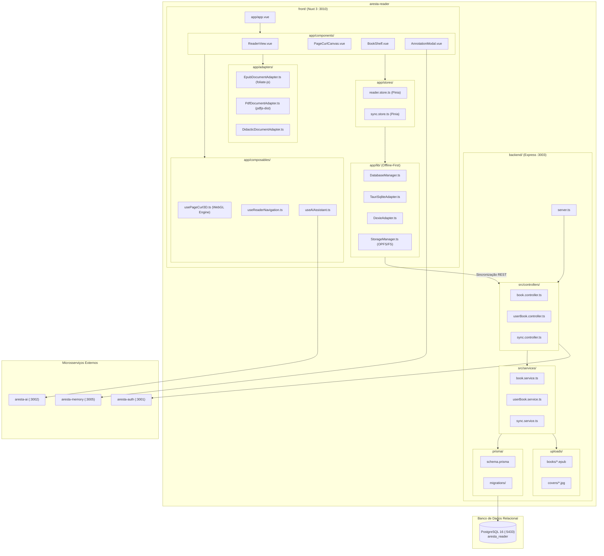

# Diagrama de Pacotes — aresta-reader

Este documento descreve a divisão dos pacotes e subsistemas do `aresta-reader`, integrando o ecossistema do Backend (Express/Prisma) e do Frontend (Nuxt 3/Tauri/WebGL).

