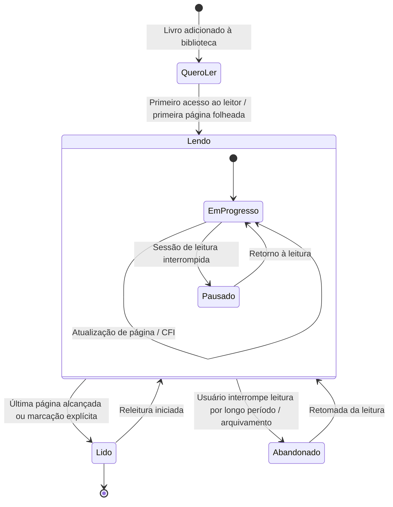
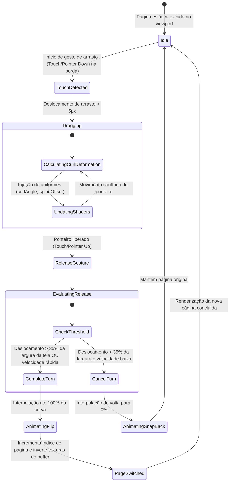
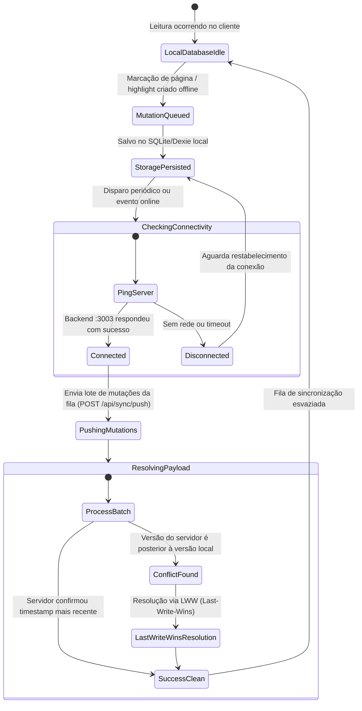

# Diagrama de Estados — aresta-reader

Este documento descreve as máquinas de estado presentes no `aresta-reader`, contemplando o status de leitura do usuário, o ciclo do motor de virada de página WebGL 3D e o sincronizador offline-first.

## 1. Ciclo de Vida do Livro (Status de Leitura do Usuário)

## 2. Máquina de Estados da Animação de Virada de Página (WebGL 3D Curl)

## 3. Máquina de Estados da Sincronização Offline-First

